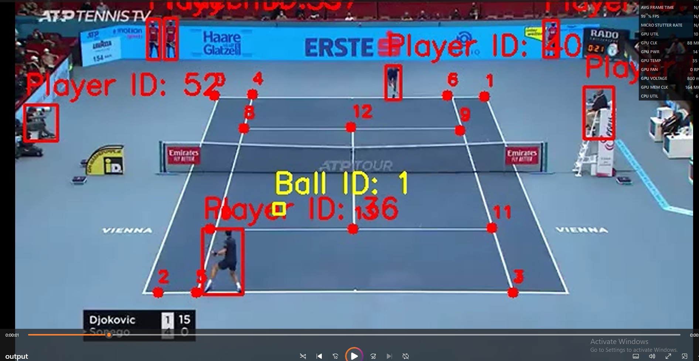
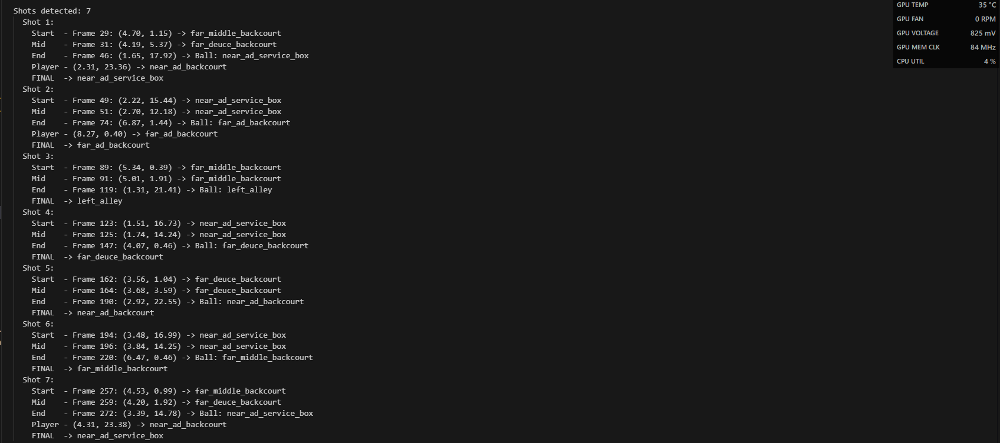
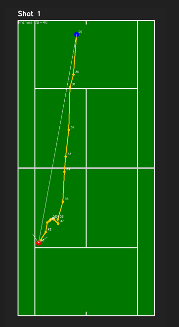
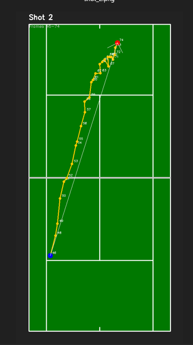

# Tennis Court Vision Analysis

Computer vision pipeline that tracks tennis ball trajectories, detects player positions, and classifies shot landing zones from broadcast video.

## What it does

Takes a tennis match video and:
- Detects players using YOLO
- Tracks the ball using TrackNet (heatmap-based neural network)
- Detects 14 court keypoints using a trained BallTrackerNet variant
- Maps pixel coordinates to real-world court positions via homography
- Identifies shots by detecting direction reversals in the ball trajectory
- Classifies each shot's landing zone (service boxes, backcourt, alleys)
- Outputs an annotated video + court diagrams showing trajectories and shot landings

## Project structure

```
cv-proj1/
├── main.py                             # main pipeline
├── yolo12n.pt                          # YOLO model for player detection
├── utils/
│   ├── video.py                        # read/write video frames
│   ├── player_utils.py                 # YOLO player detection wrapper
│   ├── ball_utils.py                   # simple ball detection (YOLO)
│   ├── ball_tracker_tracknet.py        # ball tracking with TrackNet
│   ├── tracknet.py                     # TrackNet architecture (VGG-16 encoder-decoder)
│   ├── court_detector_robust.py        # court keypoint detection (deep learning, multi-angle)
│   ├── court_line_detector.py          # legacy court detector (ResNet50)
│   ├── court_line_detector_hough.py    # court detection via Hough transforms
│   ├── homography.py                   # pixel-to-real-world coordinate transform
│   ├── court_zones.py                  # court zone classification (10 zones)
│   └── court_visualizer.py             # top-down court diagrams and trajectory plots
├── output_video/                       # annotated video output
└── runs/detect/                        # YOLO detection artifacts
```

## Required weights

You need three weight files in `cv-proj1/`:

| File | What it's for |
|------|---------------|
| `yolo12n.pt` | Player detection (YOLO v12 nano) |
| `tracknet_weights.pt` | Ball tracking (TrackNet) |
| `court_detection_weights.pth` | Court keypoint detection (BallTrackerNet, 15-channel output, trained on 8841 images) |

The court detection weights come from the [TennisCourtDetector](https://github.com/yastrebksv/TennisCourtDetector) project. The file is a full training checkpoint (~6.75GB) — the loader handles extracting just the model weights.

## How it works

### Court keypoint detection
The court detector uses a modified BallTrackerNet (VGG-16 encoder-decoder) with `in_channels=3, out_channels=15`. It outputs a 15-channel heatmap — 14 keypoints + 1 background. Keypoints are extracted by taking the argmax across channels, then using HoughCircles to find the blob center for each keypoint.

The 14 keypoints map to court intersections:
```
0 -------- 4 ----------- 6 -------- 1    far baseline
|          8 ---- 12 --- 9           |    far service line
|          |      |      |           |
|          10 --- 13 --- 11          |    near service line
2 -------- 5 ----------- 7 -------- 3    near baseline
```

The model outputs corners in clockwise order (TL, TR, BR, BL) but our system expects (TL, TR, BL, BR), so corners 2 and 3 get swapped. There's also a fallback that estimates missing near-court doubles corners from the singles sideline geometry.

### Homography
The 14 keypoints are mapped to known real-world tennis court dimensions (10.97m x 23.77m) to compute a homography matrix. This lets us transform any pixel coordinate to real-world meters on the court.

### Shot detection
Shots are detected by finding direction reversals in the ball's y-coordinate trajectory. The algorithm tracks the extreme point (highest or lowest y) and triggers a new shot when the ball reverses direction by more than 2 meters. Consecutive shots going the same direction get merged to reduce noise.

### Zone classification
Each shot landing is classified into one of 10 zones: deuce/ad service boxes, deuce/ad backcourt (near and far side), and left/right alleys. The final zone uses a fusion of ball landing position and receiving player position (60/40 weighting).

## Sample outputs

### Annotated video frame


A frame from the output video showing all detections overlaid on the broadcast feed. YOLO bounding boxes label each player with a tracking ID, the ball is marked with its own ID, and the 14 court keypoints (numbered 0–13) are drawn at their detected positions. This is what `output_video/output.mp4` looks like frame-by-frame.

### Shot detection log


Console output from the pipeline showing 7 detected shots. For each shot the log lists the start, mid, and end frames with their real-world court coordinates (in meters), the zone classification at each stage, and the final landing zone after fusing ball position with receiving player position.

### Shot 1 — top-down trajectory


Top-down court diagram for Shot 1 (frames 29–46). The orange line traces the ball's path frame-by-frame, the blue dot marks where the shot started (far baseline), and the red dot marks where it landed (near ad service box). Each numbered point corresponds to a video frame.

### Shot 2 — top-down trajectory


Top-down court diagram for Shot 2 (frames 49–74). The ball travels from the near baseline (blue dot) cross-court to the far ad backcourt (red dot). The trajectory shows the ball moving diagonally across the court, demonstrating the homography mapping from pixel space to real-world court coordinates.

## Running it

```bash
cd cv-proj1
python main.py
```

Make sure all three weight files are in the `cv-proj1/` directory. The script reads `test_video.mp4` starting at the 25 second mark, processes up to 300 frames, and outputs:
- `output_video/output.mp4` — annotated video with player boxes, ball tracking, and court keypoints
- `output_video/court_trajectory.png` — top-down court diagram with full ball trajectory
- `output_video/shot_N.png` — individual court diagrams for each detected shot

## Dependencies

- PyTorch
- OpenCV (cv2)
- NumPy
- Matplotlib
- Ultralytics (YOLO)
